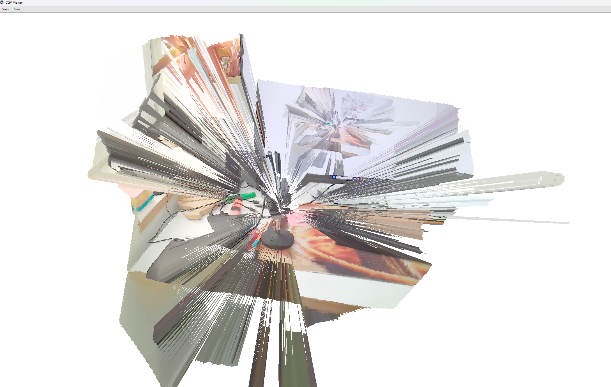

# 3dmirror
- clone this repo including submodules
```bash
git clone --recurse-submodules https://github.com/FlorianMehnert/3dmirror.git
```
## current progress


# cgv usage
- see [instructions](https://github.com/lintianfang/coding_issues_cgv/blob/master/how%20to%20use%20%20cgv_framework.txt) for common issues
## kinect issues
- in Windows make sure AZURE_KINECT_SDK environment variable is set to the [azure kinect sdk directory](https://github.com/microsoft/Azure-Kinect-Sensor-SDK)
- for 1.4.1 C:\Program Files\Azure Kinect SDK v1.4.1\sdk
- add `%AZURE_KINECT_SDK%\windows-desktop\x86\release\bin` [to PATH](https://www.architectryan.com/2018/03/17/add-to-the-path-on-windows-10/)
    - should this not work for your pc: add `%AZURE_KINECT_SDK%\windows-desktop\amd64\release\bin` instead to PATH (make sure this is not set multiple times)
- camera not accessible for kinect viewer: allow desktop apps to access camera [(Start > Settings > Privacy & security > Camera)](https://support.microsoft.com/en-us/windows/manage-app-permissions-for-your-camera-in-windows-87ebc757-1f87-7bbf-84b5-0686afb6ca6b)

## build the mirror3D
1. download [visual studio 2022](https://visualstudio.microsoft.com/de/downloads/)
2. drag "project" folder to [`define_project_dir.bat`](../cgv/define_project_dir.bat)
3. drag the "build" folder to [`define_system_variables.bat`](../cgv/define_system_variables.bat) and select j for visual studio 2022
4. open the batch file [`define_platform.bat`](../cgv/define_platform.bat) and set to 64
5. bind the .pj extension to the [`generate_makefiles.bat`](../cgv/bin/generate_makefiles.bat)
